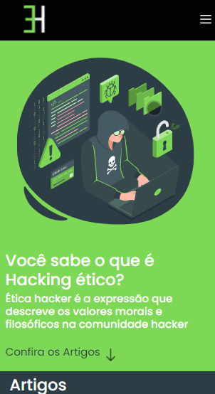

<h1 align="center"> Hacking Ético </h1>

<h1> Desktop 💻</h1>

 

<h2> Section Artigos </h2>

  

<h1> Mobile 📱 </h1>

  
<h1> Sobre 🔖</h1>

Projeto desenvolvido como trabalho final da disciplica de Computação, ética e sociedade do curso de Ciência da Computação da UFBA. Utilizamos as tecnologias: HTML, CSS e JS. O site é responsivo, se adequando a diferentes resoluções dos diversos aparelhos disponíveis no mercado.

  
<h1>💻 Acessar página</h1>

Para acessar a página acesse o link : <a href="https://iury-assuncao.github.io/Hacking_etico/" target="_blank">HackingÉtico</a>
